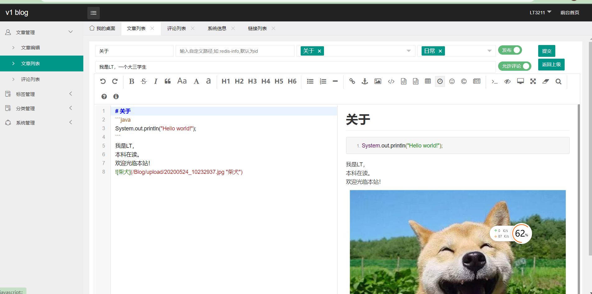

# LTBlog
> LT Blog 是由 SSMplus + Layui + Thymeleaf 等技术实现的 Java 博客系统，页面美观、功能齐全、部署简单及完善的代码

### 部署

> [博客地址](http://47.115.43.39/Blog/) 

#### 步骤

1. mysql导入提供的sql文件，修改配置文件中数据库文件
2. 安装tomcat，把war包放入webapps目录
3. 安装nginx代理tomcat
4. 访问`主机名+/Blog`

### 项目截图

